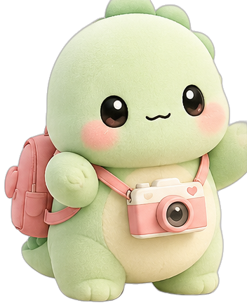

# Dear Memory 💖

> Some moments only happen once. Let's keep this one forever.

A magical little online world where people save the moments they never want to
lose — a Korean-style photobooth, dreamy filters, scrapbooks, timelines, and
time capsules, all guided by **Mochi Dino**, the official brand mascot.



## 🦕 Mochi Dino

Mochi Dino is **not decoration** — he is a living character inside the website.
All mascot artwork in `public/mochi/` and `docs/brand/` is the **official brand
art** (mint green palette, rosy blush cheeks, tiny camera, heart backpack,
plush toy appearance). It is never redrawn or redesigned — the site always
renders the real artwork.

In the app, Mochi:

- welcomes you on the homepage (*"Hi friend! 💖"* — or *"Welcome back! I missed you! 💖"* if you've visited before)
- floats, breathes, **blinks**, and leans toward your cursor
- does a happy jump with a burst of hearts when you tap him
- guides the whole photobooth (*"3...2...1... Smileeee! 📸"*)
- celebrates achievements with cute toasts

## ✨ What works today

| Feature | Status |
| --- | --- |
| Korean photobooth — front/rear camera, live preview, countdown, auto-capture, 4 & 6 photo strips, per-photo retake | ✅ |
| 13 real-time filters (Korean Beauty, Soft Skin, Peach Cream, Milk Tea, Dreamy Glow, Fairy Glow, Kawaii Pink, Cool Girl, Y2K Flash, Vintage Film, Mono Film, Anime Style…) | ✅ |
| ✨ Real skin smoothing (3 levels) — YCbCr skin-zone detection, eyes/lips/hair stay sharp | ✅ |
| 🎞️ Film effects baked into strips & GIFs — grain, vignette, soft glow per filter | ✅ |
| Drag-and-drop decoration — hearts, stars, bows, flowers, official Mochi stickers, titles, date stamps, 6 frame colors | ✅ |
| Strip download (composited keepsake JPEG) | ✅ |
| 🎬 GIF memory movies — the strip becomes a looping mini-film | ✅ |
| 🖼️ Build strips from gallery photos (no camera needed) | ✅ |
| 📤 One-tap sharing via Web Share (Instagram, LINE, TikTok on mobile) | ✅ |
| 🔔 Cute synthesized sounds — countdown ticks, shutter, save chime (mutable) | ✅ |
| Scrapbook mode — notes, chapters by category, treasured-diary layout | ✅ |
| Memory timeline — months blooming down a pastel stem | ✅ |
| Time capsules — seal letters for 6 months / 1 year / 5 years, animated envelope reveal | ✅ |
| Gamification — achievements (First Memory, Time Traveler, Filter Fairy…) | ✅ |
| 8 memory categories (💕 👯 🎂 🎓 👨‍👩‍👧 ✈️ 🌸 💌) | ✅ |
| PWA manifest + icons | ✅ |
| Demo mode (no camera? pastel placeholder shots so the flow still works) | ✅ |

Memories live in `localStorage` — private to the visitor's browser, no account
needed.

### 🧵 Mochi is still sewing (roadmap)

- **AI studio** — sticker generator, frame generator, background generator
- **Long Distance Mode** — shared booths over WebRTC
- **Cinematic memory movies** — Reel / TikTok video export (GIF already works!)
- **Premium** — Stripe checkout, exclusive themes, Mochi costumes
- **Accounts & sync** — Supabase + Cloudinary storage

## 🛠 Tech

Next.js 15 (App Router) · TypeScript · Tailwind CSS · Framer Motion

```bash
npm install
npm run dev      # http://localhost:3000
npm run build    # production build
```

## 📁 Project map

```
app/                  pages (home, photobooth, scrapbook, timeline, capsule, premium)
components/           MochiDino (the living mascot), PhotoboothFlow, views…
lib/                  types, storage (localStorage), filters, stickers, strip compositing
public/mochi/         official mascot artwork (cutouts from the brand sheets)
docs/brand/           the original official Mochi Dino brand sheets
```
