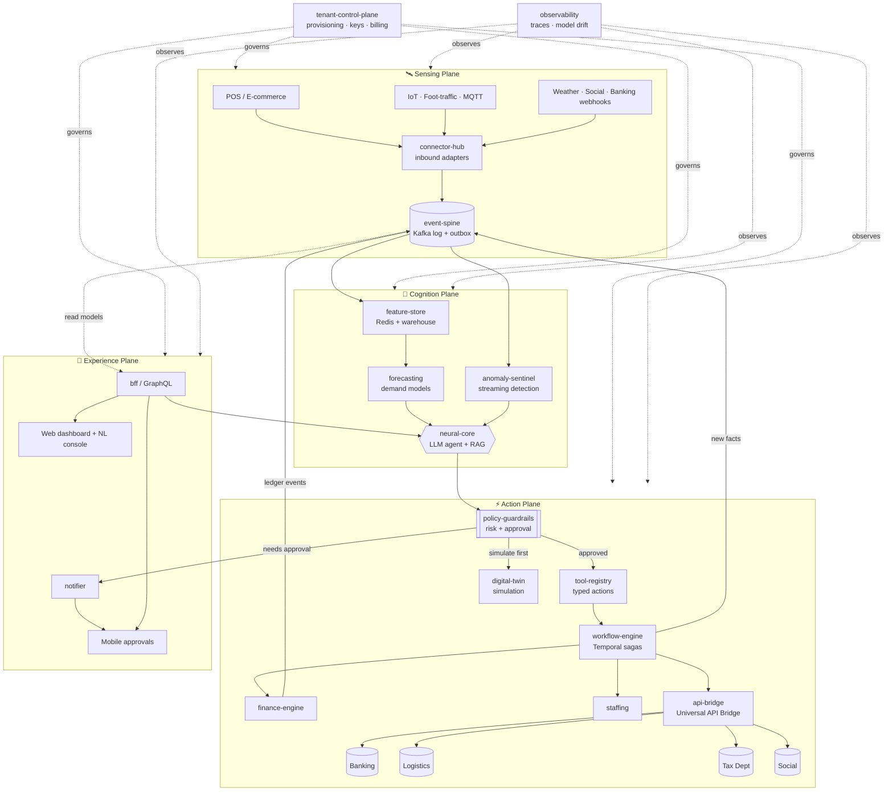
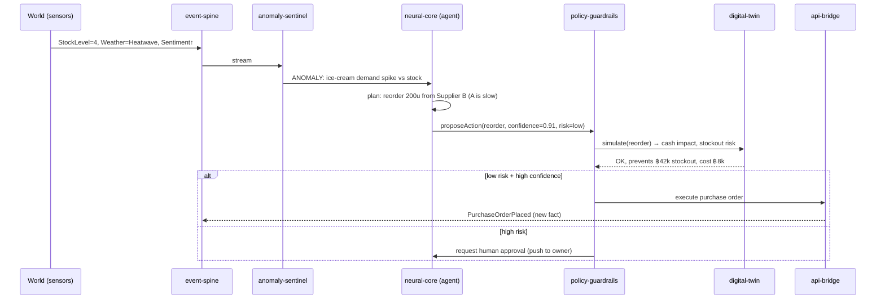

# Omni-Mind: The Neural Business Core

### Technical Blueprint v1.0 — An AI-Driven Autonomous Business Ecosystem

> **Thesis:** Traditional ERP/POS systems are *systems of record* — humans type, the
> database remembers. Omni-Mind is a *system of action* — sensors observe, models
> predict, agents decide and execute, and humans supervise by exception. The database
> is no longer the product; the **autonomous decision loop** is the product.

This document is a buildable blueprint, not a vision deck. Every choice below has a
reason and a "start today" path. The final section names the **exact first module**
and it is already scaffolded in `omni-mind/services/event-spine/`.

---

## 0. Design Principles (the reasoning behind everything else)

These five principles drive every architectural decision in this document.

1. **Event-sourced, not state-stored.** The source of truth is an immutable, ordered
   log of *facts* ("SaleOccurred", "StockDepleted", "WeatherShifted"). All state
   (inventory counts, P&L, forecasts) is a *projection* derived from the log. This is
   what makes the system cross-industry: a clinic, a café, and a logistics firm all
   emit different events, but the spine treats them identically.

2. **Schema-on-read, not schema-on-write.** We do not hard-code "products have a
   shoe size." Industry-specific shape lives in flexible attribute documents + a
   vector embedding. The relational core stays tiny and universal.

3. **Agents act through tools, never through raw DB writes.** Every autonomous action
   (reorder stock, reroute a shipment, file a tax draft) is a *typed tool call* with
   guardrails, simulation, and an audit trail. This is the single most important
   safety boundary in the system. "Autonomous" must never mean "unaccountable."

4. **Human-in-the-loop is a dial, not a switch.** Each agent action has a confidence
   score and a blast radius. Low-risk + high-confidence → execute and log.
   High-risk → simulate in the Digital Twin, then request approval. The business owner
   sets the threshold per action type.

5. **Everything is multi-tenant and tenant-isolated from line one.** Cross-industry
   means cross-customer. Row-level security and per-tenant encryption keys are not a
   "later" feature.

---

## 1. System Architecture (High-Level)

### 1.1 The four planes

Omni-Mind is organized into four horizontal planes rather than a flat microservice
mesh. Thinking in planes is what keeps a system this ambitious comprehensible.

| Plane | Responsibility | Latency budget |
| --- | --- | --- |
| **Sensing Plane** | Ingest reality: POS events, IoT/foot-traffic, weather, social, banking webhooks. | Real-time (ms–s) |
| **Cognition Plane** | Turn events into understanding: feature store, forecasting, anomaly detection, the Neural Core agent. | Near-real-time (s–min) |
| **Action Plane** | Execute decisions safely: tool registry, workflow orchestration, the Universal API Bridge, the Digital Twin. | Seconds |
| **Experience Plane** | Humans supervise: dashboards, approvals, natural-language console, mobile alerts. | Interactive |

### 1.2 Microservice decomposition

Services are split by **business capability** and by **scaling profile** (a forecasting
GPU job and a webhook receiver should never share a deployment). Each is independently
deployable, owns its data, and communicates through the event spine — never by reaching
into another service's database.

**Sensing Plane**
- `event-spine` — the universal ingestion gateway + event log. *(Module #1, scaffolded.)*
- `connector-hub` — pluggable inbound adapters (Stripe/bank webhooks, weather APIs,
  social listening, IoT/MQTT, POS).
- `identity-resolution` — dedupes customers/suppliers/SKUs across channels.

**Cognition Plane**
- `feature-store` — online (Redis) + offline (warehouse) features for ML.
- `forecasting` — demand prediction (weather × sentiment × history).
- `anomaly-sentinel` — streaming anomaly detection that triggers self-healing.
- `neural-core` — the LLM agent: planning, tool selection, reasoning, memory (RAG over
  the vector DB).

**Action Plane**
- `workflow-engine` — durable, long-running, self-healing sagas (Temporal).
- `tool-registry` — the typed, guard-railed catalog of actions agents may take.
- `api-bridge` — outbound integrations (banking, logistics, tax, social).
- `digital-twin` — simulation sandbox (Monte-Carlo + agent-based) for what-if analysis.
- `finance-engine` — autonomous bookkeeping, tax, P&L projections.
- `staffing` — shift optimization from foot-traffic + KPI signals.

**Experience Plane**
- `bff` — backend-for-frontend / GraphQL gateway.
- `web` + `mobile` — dashboards, approvals, NL console.
- `notifier` — push/email/LINE/Slack escalation.

**Cross-cutting**
- `tenant-control-plane` — provisioning, billing, feature flags, per-tenant keys.
- `policy-guardrails` — the approval/risk engine every agent action passes through.
- `observability` — traces, metrics, model-drift and decision-quality monitoring.

### 1.3 Why event-driven microservices (the reasoning)

- **Autonomy needs decoupling.** An agent rerouting a supply chain cannot block on the
  finance service being up. The event spine lets the action complete and the ledger
  catch up asynchronously.
- **Self-healing needs replay.** Because state is derived from an immutable log, a bad
  projection can be rebuilt by replaying events. A corrupted inventory count is fixed
  by reprojecting, not by frantic manual SQL.
- **Cross-industry needs a stable contract.** The event envelope is the universal
  contract; industry specifics live in the payload. Add a new vertical without touching
  the spine.
- **Cost control needs independent scaling.** GPU forecasting scales on queue depth;
  webhook ingestion scales on request rate. Coupling them wastes money at scale.

### 1.4 Architecture diagram



### 1.5 The autonomous decision loop (the heartbeat)



---

## 2. The Ultimate Tech Stack

Chosen for three properties: **proven at hyperscale**, **strong typed contracts**
(autonomy makes loose typing dangerous), and **first-class AI tooling**. "Cutting-edge"
without "operable" is a liability when agents act on real money.

### 2.1 Backend

| Concern | Choice | Why |
| --- | --- | --- |
| Core services | **Go** (high-throughput: event-spine, connector-hub, api-bridge) + **Python** (ML/agent: forecasting, neural-core) | Go for concurrency and low-latency ingestion; Python for the ML/LLM ecosystem. Don't force one language across two very different workloads. |
| Agent framework | **LangGraph** (stateful agent graphs) + **Pydantic** typed tools | Graph-based agents give explicit, inspectable, resumable control flow — essential for auditable autonomy. Raw prompt-chaining is not auditable enough to act on money. |
| LLM (reasoning) | **Claude (Fable / latest)** as the primary reasoning + tool-use model, with a smaller local/open model for cheap high-volume classification | Strong tool-use, long context for business memory, and reliable structured output. Tiered models control cost. |
| Workflow/orchestration | **Temporal** | Durable execution: long-running, self-healing sagas that survive crashes — the literal mechanism behind "self-healing workflow." |
| Event streaming | **Apache Kafka** (or Redpanda for lower ops) | The event spine. Durable, replayable, partitioned by tenant. |
| API style | **gRPC** internal, **GraphQL** at the edge (BFF), **REST/webhooks** for external | Typed internal contracts; flexible client queries; standard external surface. |

### 2.2 Frontend

| Concern | Choice | Why |
| --- | --- | --- |
| Web | **Next.js (App Router) + TypeScript + React Server Components** | SSR/streaming for data-dense dashboards; one stack the team already uses in this repo. |
| Styling/UI | **Tailwind CSS + shadcn/ui + Tremor** (charts/KPIs) | Tremor is purpose-built for analytical dashboards; ships fast. |
| Realtime | **WebSocket/SSE** via the BFF for live KPIs and approval pushes | The dashboard must reflect autonomous actions as they happen. |
| Mobile | **React Native (Expo)** | Approvals and exception alerts must be one tap from a phone. |
| NL console | Streaming chat bound to `neural-core` | "Show me why you reordered cocoa" — natural language is the primary control surface. |

### 2.3 Data layer (polyglot persistence — the right tool per shape)

| Store | Technology | Holds |
| --- | --- | --- |
| **Transactional / relational** | **PostgreSQL** (Aurora/Cloud SQL) with **row-level security** | Tenants, the universal entity core, the immutable ledger, the event outbox. |
| **Flexible attributes** | **JSONB in Postgres** (start) → dedicated document store only if needed | Industry-specific entity shapes without schema churn. |
| **Vector / semantic** | **pgvector** (start) → **Qdrant / Milvus** at scale | Embeddings for agent memory (RAG), semantic product/customer matching, similar-situation retrieval. |
| **Time-series** | **TimescaleDB** (Postgres extension) | Foot-traffic, sensor streams, KPI history, demand curves. |
| **Online feature/cache** | **Redis** | Low-latency features and hot read models. |
| **Analytical / warehouse** | **ClickHouse** (or BigQuery/Snowflake) | P&L roll-ups, training data, BI. |
| **Object storage** | **S3 / GCS** | Documents, receipts, model artifacts, event archives. |

> **Reasoning on the database mix:** start with **Postgres + extensions**
> (JSONB, pgvector, TimescaleDB) so an MVP runs on *one* database with one ops
> burden. Split out Qdrant, ClickHouse, and a dedicated TSDB only when a specific
> scaling wall demands it. Premature polyglot persistence is the #1 way ambitious
> systems die before launch.

### 2.4 AI / ML pipeline

| Stage | Tooling |
| --- | --- |
| Feature store | **Feast** over Redis (online) + warehouse (offline) |
| Training/experiments | **PyTorch** + **MLflow** (tracking/registry) |
| Forecasting models | Gradient-boosted trees (**LightGBM**) as baseline; **Temporal Fusion Transformer / TimesFM**-style models for multi-signal demand |
| Anomaly detection | Streaming z-score/EWMA + isolation forest; escalate ambiguous cases to the LLM |
| Serving | **Ray Serve** / **BentoML**; **vLLM** for any self-hosted LLM |
| Orchestration | **Kafka** (stream) + **Temporal** (workflow) + **Airflow/Dagster** (batch retrain) |
| Agent memory | RAG over pgvector/Qdrant; episodic memory of past decisions + outcomes |
| Eval & safety | **LangSmith**-style tracing, golden-set evals, and an offline replay harness that scores agent decisions against known outcomes before they go live |

### 2.5 Platform / infrastructure

- **Kubernetes** (EKS/GKE) + **Istio** for service mesh (mTLS, traffic policy).
- **Terraform** + **ArgoCD** (GitOps) for reproducible infra and deploys.
- **OpenTelemetry → Grafana/Tempo/Prometheus** for tracing and metrics, plus
  **dedicated decision-quality dashboards** (were the agent's calls correct?).
- **Vault** for secrets + per-tenant encryption keys; **SOC2/PCI/GDPR/PDPA**-ready
  controls from day one because the system touches money and personal data.

---

## 3. Core Database Schema (Conceptual)

The schema's whole job is to be **universal at the core** and **flexible at the edge**,
while feeding real-time AI. Three layers achieve this.

### 3.1 Layer A — the Universal Entity Core (relational, tiny, stable)

Every business object — a product, a patient, a vehicle, a table booking — is an
`entity` of some `entity_type`. The core columns are industry-agnostic; the shape lives
in `attributes` (JSONB) and `embedding` (vector).

```sql
-- Every row is tenant-scoped; RLS enforces isolation.
CREATE TABLE tenant (
  id            UUID PRIMARY KEY,
  name          TEXT NOT NULL,
  industry      TEXT NOT NULL,          -- 'retail','clinic','logistics','f&b'...
  config        JSONB NOT NULL DEFAULT '{}',
  created_at    TIMESTAMPTZ NOT NULL DEFAULT now()
);

-- The universal object table. One shape for ALL industries.
CREATE TABLE entity (
  id            UUID PRIMARY KEY,
  tenant_id     UUID NOT NULL REFERENCES tenant(id),
  entity_type   TEXT NOT NULL,          -- 'product','customer','supplier','asset','staff'
  external_ref  TEXT,                   -- id in the source system (POS SKU, etc.)
  display_name  TEXT NOT NULL,
  attributes    JSONB NOT NULL DEFAULT '{}',   -- schema-on-read, industry-specific
  embedding     VECTOR(1536),           -- semantic representation for AI matching/RAG
  status        TEXT NOT NULL DEFAULT 'active',
  created_at    TIMESTAMPTZ NOT NULL DEFAULT now(),
  updated_at    TIMESTAMPTZ NOT NULL DEFAULT now()
);
CREATE INDEX ON entity (tenant_id, entity_type);
CREATE INDEX ON entity USING GIN (attributes);          -- query flexible fields
CREATE INDEX ON entity USING hnsw (embedding vector_cosine_ops); -- ANN search

-- Typed relationships between entities (product→supplier, staff→shift...).
CREATE TABLE relationship (
  id            UUID PRIMARY KEY,
  tenant_id     UUID NOT NULL,
  from_entity   UUID NOT NULL REFERENCES entity(id),
  to_entity     UUID NOT NULL REFERENCES entity(id),
  rel_type      TEXT NOT NULL,          -- 'supplied_by','works_at','located_in'
  attributes    JSONB NOT NULL DEFAULT '{}'
);
```

**Why this works cross-industry:** a clinic's "patient" and a café's "loyalty
customer" are both `entity_type='customer'` with different `attributes`. AI features
(matching, dedupe, similarity) operate on `embedding` uniformly. No schema migration to
onboard a new vertical.

### 3.2 Layer B — the Event Log + Ledger (immutable, append-only)

This is the spine and the source of truth. Everything else is a projection.

```sql
-- The universal event envelope. Append-only. Never UPDATE/DELETE.
CREATE TABLE event_log (
  id            BIGSERIAL PRIMARY KEY,           -- global order
  event_id      UUID NOT NULL UNIQUE,            -- idempotency key
  tenant_id     UUID NOT NULL,
  stream_id     UUID NOT NULL,                   -- aggregate this event belongs to
  event_type    TEXT NOT NULL,                   -- 'SaleOccurred','StockReceived'...
  schema_version INT  NOT NULL DEFAULT 1,
  payload       JSONB NOT NULL,                  -- the fact, industry-shaped
  occurred_at   TIMESTAMPTZ NOT NULL,            -- when it happened in the world
  recorded_at   TIMESTAMPTZ NOT NULL DEFAULT now(), -- when we learned it
  causation_id  UUID,                            -- the event that caused this
  correlation_id UUID,                           -- ties a whole workflow together
  actor         TEXT NOT NULL                    -- 'human:u123' | 'agent:neural-core'
);
CREATE INDEX ON event_log (tenant_id, stream_id, id);
CREATE INDEX ON event_log (tenant_id, event_type, occurred_at);

-- Double-entry financial ledger, itself just a projection of financial events.
CREATE TABLE ledger_entry (
  id            BIGSERIAL PRIMARY KEY,
  tenant_id     UUID NOT NULL,
  event_id      UUID NOT NULL REFERENCES event_log(event_id), -- provenance
  account       TEXT NOT NULL,                   -- 'cash','revenue','cogs','tax_payable'
  direction     CHAR(1) NOT NULL CHECK (direction IN ('D','C')),
  amount_minor  BIGINT NOT NULL,                 -- integer minor units, never float money
  currency      CHAR(3) NOT NULL,
  occurred_at   TIMESTAMPTZ NOT NULL
);
```

**Why event-sourced + ledger:** `actor` makes every fact attributable to a human or a
named agent — the audit trail autonomy demands. `causation_id`/`correlation_id` let you
reconstruct *why* the agent did something. Integer minor units eliminate floating-point
money bugs. The P&L is `SELECT`ed from `ledger_entry`, so it's always reconcilable and
never silently wrong.

### 3.3 Layer C — Projections, Features & AI memory (derived, rebuildable)

```sql
-- Read models: fast current-state views rebuilt by replaying event_log.
CREATE TABLE projection_inventory (
  tenant_id   UUID, entity_id UUID, on_hand INT, reorder_point INT,
  updated_through_event BIGINT,        -- replay watermark for consistency
  PRIMARY KEY (tenant_id, entity_id)
);

-- TimescaleDB hypertable for sensor/KPI streams feeding forecasting.
CREATE TABLE metric_series (
  tenant_id UUID, metric TEXT, entity_id UUID,
  ts TIMESTAMPTZ NOT NULL, value DOUBLE PRECISION
);
SELECT create_hypertable('metric_series','ts');

-- Agent episodic memory: every decision + its eventual outcome, embedded for RAG.
CREATE TABLE decision_memory (
  id UUID PRIMARY KEY, tenant_id UUID,
  situation   JSONB,          -- features at decision time
  action      JSONB,          -- what the agent did
  rationale   TEXT,           -- the agent's reasoning
  outcome     JSONB,          -- what actually happened (filled in later)
  reward      DOUBLE PRECISION, -- did it help? trains future behavior
  embedding   VECTOR(1536),
  created_at  TIMESTAMPTZ DEFAULT now()
);
```

`decision_memory` is the system's compounding advantage: the agent retrieves *similar
past situations and their outcomes* before acting, so the ecosystem literally gets
wiser with every decision. This is the "Neural" in Neural Business Core.

### 3.4 Data flow summary

```
World → event_log (truth) → projections (current state)
                          → metric_series (forecasting)
                          → feature-store (online ML)
                          → entity.embedding + decision_memory (agent RAG)
                          → ledger_entry (finance)
```

---

## 4. MVP Execution Roadmap

The trap with a "centuries ahead" system is building the cathedral before the door.
We build the **decision loop on one vertical, one real action**, then widen.

### Phase 1 — The Nervous System (Weeks 1–8) — *foundation*
**Goal:** events flow in, state is derived, one dashboard shows live truth.
- `event-spine`: universal event ingestion + append-only log + outbox. **← start here**
- `connector-hub`: one real connector (a POS or Stripe webhook) + a weather connector.
- Postgres core (entity, event_log, ledger, projections) with RLS multi-tenancy.
- Minimal BFF + Next.js dashboard showing live inventory & sales projections.
- **Exit criteria:** a real sale at a pilot business appears on the dashboard in
  seconds, and inventory auto-decrements from events. No AI yet — just a trustworthy spine.

### Phase 2 — The First Sense (Weeks 9–18) — *predict + detect*
**Goal:** the system sees the future and flags trouble.
- `feature-store` + `forecasting`: demand model from history × weather × (basic) sentiment.
- `anomaly-sentinel`: streaming detection (stockout risk, revenue dips).
- TimescaleDB metric series; first KPI dashboards.
- **Exit criteria:** "You'll run out of X by Thursday" predictions, validated against
  held-out data, surfaced to the owner. Still *advisory*, not yet acting.

### Phase 3 — The First Action (Weeks 19–30) — *autonomy with guardrails*
**Goal:** the agent does one thing, safely, end to end.
- `neural-core` (LangGraph agent) + `tool-registry` (start with ONE tool: `reorder_stock`).
- `policy-guardrails`: confidence/risk thresholds + human approval flow + mobile push.
- `workflow-engine` (Temporal): durable, self-healing reorder saga.
- `digital-twin` v0: simulate the reorder's cash & stockout impact before executing.
- `decision_memory`: log every decision + outcome for learning.
- **Exit criteria:** the system autonomously drafts (then, once trusted, executes) a
  stock reorder when an anomaly is detected — fully audited, owner can veto from phone.
  *This is the moment Omni-Mind stops being software and becomes an operator.*

### Phase 4 — The Ecosystem (Weeks 31+) — *widen and deepen*
- `finance-engine`: autonomous bookkeeping, tax calc, P&L from the ledger.
- `staffing`: shift optimization from foot-traffic + KPI.
- `api-bridge`: real banking, logistics, tax, social integrations.
- `digital-twin` full: simulate expansions and marketing strategies.
- More tools, more verticals, lower human-approval thresholds as trust accrues.
- Marketplace of connectors & industry templates → true cross-industry scale.

### What to code **today** (the exact first module)

**`event-spine` — the Universal Event Gateway.** Everything in this blueprint is a
consumer of the event log; nothing can be built or tested without it. It is the one
component that, if missing, blocks all others, and if present, unblocks all others.

Its v0 contract is deliberately small:
1. Accept an event over HTTP/gRPC with the universal envelope (§3.2).
2. Validate the envelope, enforce tenant isolation, enforce **idempotency** via `event_id`.
3. Append to `event_log` and publish to Kafka **atomically** (transactional outbox
   pattern — the classic correctness trap in event-driven systems; we solve it from day one).
4. Drive one projection (`projection_inventory`) so we prove the read-model loop.

A runnable, dependency-light reference implementation of this contract is scaffolded in
[`omni-mind/services/event-spine/`](../services/event-spine/) — start there.

---

## 5. Appendix — How each headline feature maps to this blueprint

| Marketing capability | Concretely, it is… |
| --- | --- |
| **Predictive Intelligence** | `forecasting` consuming `metric_series` (history) + weather/social connectors via `feature-store`. |
| **Self-Healing Workflow** | `anomaly-sentinel` → `neural-core` → Temporal saga in `workflow-engine`; replayable `event_log` repairs bad state. |
| **Universal API Bridge** | `api-bridge` + `connector-hub`: typed inbound/outbound adapters, one envelope contract. |
| **Automated Financial Engine** | `finance-engine` projecting `ledger_entry` from financial events; integer money; double-entry. |
| **Digital Twin Simulation** | `digital-twin` replays/forks the event stream into a sandbox for Monte-Carlo what-ifs. |
| **Smart Staffing** | `staffing` optimizing over foot-traffic `metric_series` + KPI projections. |
| **Autonomous decision-making** | The §1.5 loop: sense → predict → plan → guardrail → simulate → act → learn. |

> **The one sentence to remember:** Build the **event spine** and the **guard-railed
> decision loop** first. Every "centuries ahead" feature is a plug-in on top of those
> two foundations — and neither of them is exotic. You can start today.
